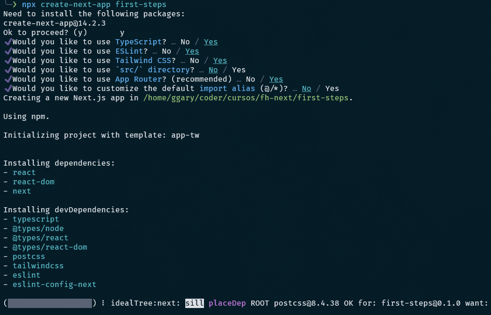

# RESUMEN CURSO NEXTJS

#### :copyright: Resumen de Fernando Herrera [Udemy](https://www.udemy.com/course/nextjs-fh)

###### [:page_with_curl: Todos](https://garydav.github.io/blogs-course) mis resúmenes por [@garyDav](https://github.com/garyDav)

> :spiral_calendar: Published on April 15, 2023

---

##### Introducción

Éste es un resumen del curso NextJS de [Fernando Herrera](https://fernando-herrera.com) resumida por [Gary Guzmán](garydav.com).

- Cada Sección está emparejada a las secciones utilizadas por el temario del curso.

- En cada Ejemplo o Proyectos realizados, se detallará la estructura inicial del mismo y la resolución paso a paso.

#### Requisitos previos

Para seguir este tutorial en caso de trabajar con Ubuntu, necesitará lo siguiente:

- Un servidor de desarrollo con Ubuntu 22.04, un usuario no root con privilegios `sudo` y un firewall activo. Consulte esta [guía de configuración inicial para servidores](https://www.digitalocean.com/community/tutorials/initial-server-setup-with-ubuntu-22-04).

- Docker instalado en su servidor, siguiendo los pasos 1 y 2 de [How To Install and Use Docker on Ubuntu 22.04](https://www.digitalocean.com/community/tutorials/how-to-install-and-use-docker-on-ubuntu-22-04).

- Docker Compose instalado en su servidor conforme el paso 1 de [How To Install and Use Docker Compose on Ubuntu 22.04](https://www.digitalocean.com/community/tutorials/how-to-install-and-use-docker-compose-on-ubuntu-22-04).

- Una Alternativa a S.O. Linux se utilizará WSL2 con Windows 11 Pro, es lo que utilizaré en el resumen.

#### Conocimientos previos

- JasaScript Básico o Intermedio (ECMAScript 6).

- Manejo de la terminal Básico

---

## Sección 1: Introducción

En esta sección, se revisan distintos puntos de como utilizar la plataforma del curso en sí, rescataremos las instalaciones necesarias:

#### Instalaciones Recomendadas

##### Instalaciones recomendadas - Curso de Next.js

##### Instalaciones Necesarias

- [Visual Studio Code](https://code.visualstudio.com/)

- [Postman](https://www.postman.com/downloads/)

- [Mongo Compass](https://www.mongodb.com/try/download/compass)

- [Git](https://git-scm.com/)

```
git config --global user.name "Tu nombre"
git config --global user.email "Tu correo"
```

- [Node](https://nodejs.org/es/)

```opcional - Yarn
npm install --global yarn
```

- [Google Chrome](https://www.google.com.mx/intl/es-419/chrome/?brand=CHBD&gclid=Cj0KCQiAtrnuBRDXARIsABiN-7AAMm13Ae3KDIib46Laxfe6tzD_w4yvDdpq5XsPw1eNlOkZ_0-3x3IaAvLEEALw_wcB&gclsrc=aw.ds)

- [Docker Desktop](https://www.docker.com/get-started)

Descargar imagen de Mongo 5.0.0

```
docker pull mongo:5.0.0
```

##### Extensiones de VSCode

[Activitus Bar](https://marketplace.visualstudio.com/items?itemName=Gruntfuggly.activitusbar)

##### Configuración del Bracket Pair Colorizer 2

[Bracket Pair Colorizer 2](https://marketplace.visualstudio.com/items?itemName=CoenraadS.bracket-pair-colorizer-2)

```
"bracket-pair-colorizer-2.colors": [
    "#fafafa",
    "#9F51B6",
    "#F7C244",
    "#F07850",
    "#9CDD29",
    "#0098FA"
],
```

##### Tema que estoy usando en VSCode

- [Tokyo Night](https://marketplace.visualstudio.com/items?itemName=enkia.tokyo-night)

- [Iconos](https://marketplace.visualstudio.com/items?itemName=PKief.material-icon-theme)

##### Instalaciones adicionales

- [NextJs Snippets](https://marketplace.visualstudio.com/items?itemName=willstakayama.vscode-nextjs-snippets)

- [ES7 React/Redux](https://marketplace.visualstudio.com/items?itemName=dsznajder.es7-react-js-snippets)

- [Simple React Snippets](https://marketplace.visualstudio.com/items?itemName=burkeholland.simple-react-snippets)

- [Auto Close Tag](https://marketplace.visualstudio.com/items?itemName=formulahendry.auto-close-tag)

- [Paste JSON as Code](https://marketplace.visualstudio.com/items?itemName=quicktype.quicktype)

- [TypeScript importer](https://marketplace.visualstudio.com/items?itemName=pmneo.tsimporter)

- [CSS Modules](https://marketplace.visualstudio.com/items?itemName=clinyong.vscode-css-modules)

- [.env](https://marketplace.visualstudio.com/items?itemName=mikestead.dotenv)

## Sección 2: Introducción a Next.js

**Next.js**, es un Framework poderoso para servir contenido estático y generado desde el lado del servidor, todo lo que puedes hacer en React.js lo puedes hacer en Next.js.

Al ser un marco de trabajo hay ciertos lineamientos, ciertas herramientas, que ya vienen al abrirlo de la caja, es bastante poderoso.

En pocas palabras, puedes hacer todo o que sabes en **React** + Mejoras de rendimiento, SEO, separación de código, router, dependencias, y más.

En el sitio oficial de React, menciona que si ustedes quieren incluir aplicaciones renderizadas del lado del servidor, recomiendan que ustedes prueben Next.js, también hay otro popular que es Gatsby, si quieren crear contenido estático, por ejemplo páginas web estáticas, pero Next.js también ofrece ese servicio, de hecho Next.js y Gatsby son cierta competencia una entre otra.

Otro punto importante que se mira desde la documentación oficial de React.js es que se asume que nuestro entorno de trabajo, o lo que tenemos en el backend por ejemplo es Node.js, esto no significa que necesariamente tienen que utilizar Node.js en el Backend para realizar nuestras API, pueden utilizar lo que guste, péro traten de dar una oportulidad a Node.js, pueden hacer todo con Node.js acceder al FileSystem del Servidor, etc. es súmamente poderoso.

Next.js cambia el paradigma de los **SPA** (Single Page Application), y te da opciones para trabajar tus aplicaciones. Por ejemplo pueden tener dos características principales como ser el **_Server-Side Rendering_** y/o **_Generación Estática_**. Al mismo tiempo, Next.js ofrece:

- **SSR:** Server-side rendering.
- **SSG:** Static-site generation.
- **CSR:** Client Side Rendering.
- **ISR:** Incremental Static Regeneration.
- **DR:** Dynamic Routing.

#### Un SPA funciona así

1. El usuario entra a una [URL](#) el cual inicial la primera solicitud, lo llamamos (request).

2. Luego el servidor responde con un (reponse).

3. Ahí es donde el cliente recibe esa solicitud, ésta tiene la información de diferentes dependencias que vamos a ocupar, los estilos hay que cargarlos de este URL, etc. Usualmente viene un documento **HTML** con todas sus referencias, que son necesarias para mostrar la aplicacion como nosotros queremos.

4. Si estamos trabajando con un SPA, todo el sitio web o la mayor parte de él. La computadora cliente (Navegador) interpreta la respuesta y aquí viene nuestro contenido de React.js, React empieza a generar la aplicación, empieza a usar el `useState`, los `useEffect`, los `useLayoutEffect`, el `useReducer`, crea el `context`, ahí empieza a generar toda esa parte, esto no es malo es sumamente poderos y útil que podamos crear **SPA**. Especialmente si son aplicaciones que están en la intranet, aplicaiones que no importa que sean **SEO friendly**.

**¿Qué pasaría si una persona (Cliente) sólo quiere ver el `About` de nuestro sitio web?**, entonces cargaría absolumamente todo, cargaría completamente toda la aplicación y eso implica módulos que posiblemente nunca usará, pero quizá lo peor de todo es que el **SPA no** es **SEO friendly**, los SPA tienen SEO, pero sólo en una pantalla, por que es la única página que se está generando, se puede hacer difierentes alteraciones, y el equipo de Google dijo que pronto los bots puedan renderizar la aplicación en memoria para así analizar meta tags y otra información, por el momento los SPA son conciderados no SEO friendly.

**¿Y qué es eso del SEO (Search Engine Optimization)?**, esto ayuda mucho a los bots que rondan el internet, analizando nuestros sitios web y ver que enlaces tienen, van siguiendo cada uno de esos enlaces y lo indexan todo, para cuando buscamos en google rápidamente tengamos resultado, esto es sumamente importante para algunos tipos de aplicaciones, si son aplicaciones que estarán en la intranet posiblemente el SEO no lo ocupemos jamás, pero hay ciertas aplicaciones que no pueden ser concebidas si no son SEO friendly.

**¿Por que es tan importante el SEO?**, es el impacto que esa aplicación tendrá en el internet. es lo que tenemos que ofrecer a los buscadores mas importantes del mundo, que es lo que hace su aplicación, en determinado URL.

### Recomendaciones

<https://legacy.reactjs.org/docs/hooks-intro.html>

<https://fernando-herrera.com/#/search/react>

<https://www.youtube.com/watch?v=dNxaP_BTtwQ&list=PLCKuOXG0bPi26-eawizqyLOgM7j66H_4M>

<https://developers.google.com/search/docs/crawling-indexing/special-tags?hl=es>

### Primer proyecto de NextJS

Pueden consultar en <https://nextjs.org/docs>

```fish
pnpm create next-app initial-demo
mv initial-demo 01-initial-demo
cd 01-initial-demo
pnpm dev # En caso de error realizar lo siguiente
pnpm add -D autoprefixer
# --- Error:
touch postcss.config.json
```

```json
{
  "plugins": ["autoprefixer"]
}
```

```fish
# Fin Error ---
Ctrl + c # Cancelen la terminal y vuelvan a iniciar
pnpm dev # ingresar a localhost:3000
```

Dentro de `./pages/`, es obligatorio que las páginas sean la exportación por defecto, y que los archivos estén en minúsculas.
Si el archivo es `index.jsx` la URL buscará un `index.html`, si el arhivo `jsx` tiene otro nombre como: `home.jsx` la URL reconocerá `localhost:3000/home`.

Así como definamos los `path's` es como usaremos en la navegación, y creando las rutas de manera implícita basada en **fileSystem**.

Al ejecutar `pnpm dev` ó `pnpm build`, genera unos archivos en la carpeta `.next`.

El archivo `./pages/_app.js` es un archivo común que comparte todas las páginas, ideal para incluir `navbar` y/o `footer`.

### Convertir JSX a TSX

Pueden consultar el proyecto `02-initial-demo`.

### Desplegando nuestra aplicación

**Desplegar la aplicación en Local.**

```fish
cd 02-initial-demo
pnpm install
yarn build
yarn start
```

**Desplegar la aplicación en Vercel.**

- Crear una cuenta con GitHub en [Vercel](https://vercel.com).

- Crear un repositorio en GitHub (en mi caso `next-vercel`)

> Si ya tenías un repositorio en la carpeta `02-initial-demo`, o sea, hiciste `git init` y `git remote add origin <repo>` en dicha carpeta.
> Entonces realizar lo siguiente:

```fish
git add .
git commit -m "Pre-deployment Vercel"
git remote add upstream git@github.com:<user>/next-vercel.git # upstream solo es un nombre
git push upstream main
git remote -v # Podras ver los repositorios ligados a tu directorio
```

> Si el `git init` y `git remote add origin <repo>` está en un directorio superior como `curso-next/02-initial-demo`.
> Entonces realizar lo siguiente:

```fish
# Estando en curso-next
cd 02-initial-demo
git init
git add .
git commit -m "Pre-deployment Vercel"
git remote add origin git@github.com:<user>/next-vercel.git
git push -u origin main
```

- Crear un nuevo proyecto que Vercel y añadir nuestro repositorio y dejamos que compile y termine el despliegue.

- Ingresamos a nuestra página ya desplegada y eso es todo les creará una dirección parecida a esta `https://next-vercel-zeta.vercel.app/`

**Desplegar la aplicación en Docker.**

- Revisar: `02-initial-demo/.dockerignore`

- Revisar: `02-initial-demo/Dockerfile`

```fish
# Ejecutar
docker build -t nextjs-initial .
docker run --name=next-app -p 3000:3000 nextjs-initial
```

## Sección 2.1 Primer Proyecto (Actualizado)

### Instalación

```bash
npx create-next-app first-steps
```



## Sección 3: Static Generated App - Pokemon Static

### Temas puntuales de la sección

Esta sección es sumamente importante para comprender cómo podemos crear de forma estática páginas aunque tengan argumentos dinámicos.

Puntualmente veremos:

- Multiples componentes de NextUI

- Flex Layout

- Temas de NextUI

- Next \_document

- Navegación

- Parámetros por URL

- Parámetros estáticos

- Next - GetStaticProps

- Next - getStaticPaths

- Generar 151 páginas de forma estática en tiempo de construcción (build time)

### Instalación del proyecto

```fish
pnpm create next-app
✔ What is your project named? … pokemon-static
✔ Would you like to use TypeScript with this project? … No / *Yes
✔ Would you like to use ESLint with this project? … No / *Yes
✔ Would you like to use Tailwind CSS with this project? … *No / Yes
✔ Would you like to use `src/` directory with this project? … *No / Yes
✔ Use App Router (recommended)? … *No / Yes
✔ Would you like to customize the default import alias? … *No / Yes

mv pokemon-static 03-pokemon-static
cd 03-pokemon-static
pnpm dev
# --- En caso de Error "autoprefixer" realizar lo siguiente:
pnpm add -D autoprefixer
touch postcss.config.json
--- # Content JSON
{
  "plugins": ["autoprefixer"]
}
---
pnpm dev # Solucionado
```

### Modificando el proyecto base

Eliminar archivos innecesarios.

```fish
rm -R pages/api
nvim styles/globals.css
~ ^a d # NVIM: seleccionar todo y eliminar contenido
~ :wq # NVIM: guardar y salir
rm public/next.svg
rm public/vercel.svg
rm styles/Home.module.css
```

En caso que quieran añadir prettier.

```fish
pnpm add -D prettier eslint-config-prettier # Add Prettier
nvim .prettierrc
--- # Content JSON
{
  "useTabs": false,
  "semi": false,
  "singleQuote": true,
  "jsxSingleQuote": true,
  "bracketSameLine": true,
  "arrowParens": "avoid",
  "trailingComma": "all"
}
---
nvim .eslintrc.json
--- # Content JSON
{
  "extends": ["next/core-web-vitals", "eslint-config-prettier"],
  "rules": {
    "linebreak-style": ["error", "unix"],
    "quotes": ["error", "single"],
    "semi": ["error", "never"],
    "comma-dangle": [2, "always-multiline"],
    "no-unused-vars": "warn"
  }
}
---
```

Modificando Home con lo básico `page/index.tsx`.

```tsx
import { NextPage } from "next";

const HomePage: NextPage = () => {
  return (
    <>
      <h1>Hola Mundo</h1>
    </>
  );
};

export default HomePage;
```

### NextUI React UI Library

Instalación `pnpm add @nextui-org/react`, seguir las instrucciones [NextUI](https://nextui.org/docs/guide/getting-started)
